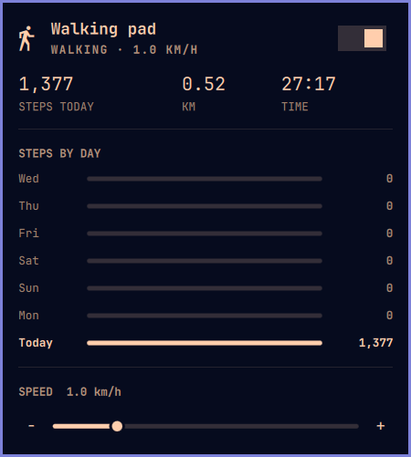

# Sperax Walking Pad for Omarchy

An [Omarchy](https://omarchy.org) shell plugin for the Sperax RM-01 walking pad and its rebadged versions (sold as Freepi and others). It talks to the pad over Bluetooth, so you don't need the phone app.



- Today's step count next to a walker icon in the bar
- A panel with a start/stop switch, current speed, and today's steps, distance and time
- Speed control from 0.2 to 4.0 km/h in 0.1 steps (slider, −/+ buttons, or keys)
- A chart of steps per day for the last week

Today's total keeps adding up across walks. The pad resets its own counters every time the belt starts.

## Supported hardware

Pads that advertise over Bluetooth as `SPERAX_RM01`. They use a WiLink `WLT6200` module with the vendor service `FFF0`. To check yours:

```bash
bluetoothctl --timeout 10 scan le | grep SPERAX
```

If your pad uses a different Bluetooth name, set `WALKING_PAD_NAME` in the environment of `omarchy-shell`.

## Requirements

- Bluetooth turned on (`bluez`)
- The `python-bleak` package from the official Arch repos. The plugin runs a small Python helper for Bluetooth.

## Install

```bash
omarchy plugin add https://github.com/backmeupplz/omarchy-sperax-walking-pad --enable
```

The walker icon appears on the right of the bar. It's dimmed until the pad is found.

## Usage

- **Click** the icon to open the panel. **Middle-click** starts or stops the belt.
- In the panel, **space** or **enter** starts or stops the belt, and **←/→** or **−/+** change the speed by 0.1 km/h.
- Starting gives the pad's own 3-2-1 countdown first. The belt always starts at 1.0 km/h, and the plugin sends your chosen speed once the belt is moving.

The pad accepts one Bluetooth connection at a time. Close the phone app while using the plugin.

## Safety

If the shell restarts or the plugin reloads, the plugin does not stop the belt. It keeps its current speed, so it never stops suddenly under you. Keep the remote nearby to stop the belt yourself.

The US CPSC has issued a [warning about Sperax walking pads](https://www.cpsc.gov/Warnings/2026/CPSC-Warns-Consumers-to-Stop-Using-Sperax-Walking-Pads-and-Treadmills-Immediately-Due-to-Risk-of-Serious-Injury-from-Fall-Burn-and-Fire-Hazards), including the RM-01.

## Data

- Step history: `~/.local/share/walking-pad/history.json`
- Raw Bluetooth frames (for debugging the protocol): `~/.cache/walking-pad/frames.log`

## Remove

```bash
omarchy plugin remove io.github.backmeupplz.sperax-walking-pad
rm -rf ~/.local/share/walking-pad ~/.cache/walking-pad   # optional: delete history and logs
```

## Protocol

The commands come from [nathanabrewer/sperax-rm01](https://github.com/nathanabrewer/sperax-rm01). This plugin adds two things decoded from a real pad:

- **Byte stuffing.** Any byte `>= 0xF0` between the length byte and the `FA` trailer is sent as `F0 0x`. Frames can also arrive split across two notifications.
- **Telemetry.** The reply to `0x19` is big-endian. `d2` is the state: `13/12/11` countdown, `10` running, `0F` stopping, `00/02` idle. `d5-6` is seconds, `d7-8` is distance in 10 m units, `d9-10` is kcal, `d11-12` is steps, and `d13` is speed in 0.1 km/h units.

`python3 pad.py test` runs the protocol self-check.

## License

MIT
